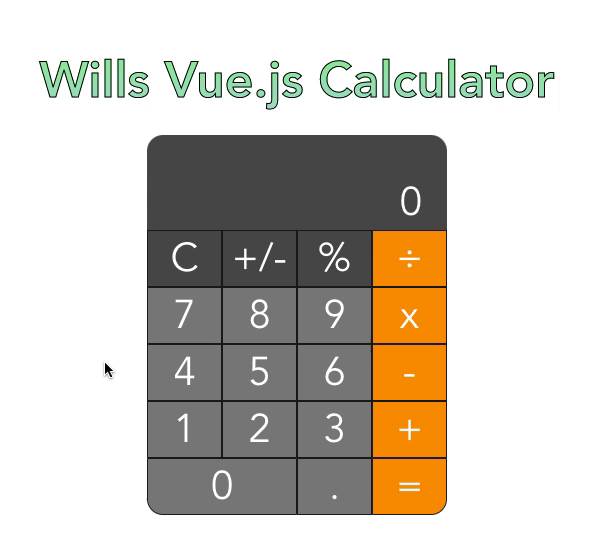

<h1 align="center">Wills Vue.js Calculator</h1>
<h3 align="center">Wills Vue.js Calc is a fully functional calculator modeled after the mac system calculator written in vue.js</h3>
<p align="center">

</p>


## Project setup
```
yarn install
```

### Compiles and hot-reloads for development
```
yarn serve
```

### Compiles and minifies for production
```
yarn build
```

### Lints and fixes files
```
yarn lint
```
